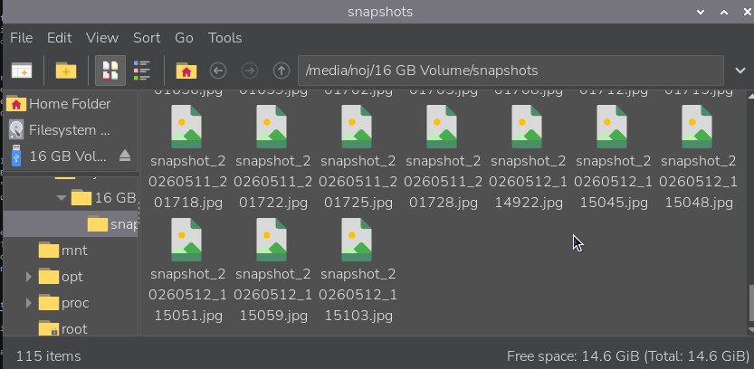
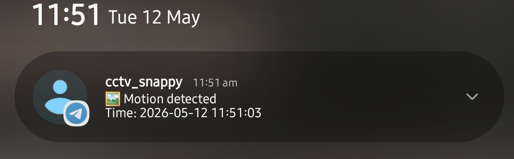

# CCTV Motion Monitor

A motion-detection CCTV system running on **Raspberry Pi 5** with a **NoIR v3 camera**. Detects motion from live camera frames and sends instant snapshot alerts via Telegram.

## Demo

| Snapshots on storage | Telegram notification | Telegram alert with photo |
|---|---|---|
|  |  |  |

## How It Works

1. Continuously captures frames from the Pi camera.
2. Compares consecutive frames using grayscale pixel-diff analysis.
3. On motion: saves a timestamped `.jpg` snapshot and sends it to a Telegram chat.
4. Auto-prunes old snapshots to stay within a configurable limit.

## Project Files

| File | Purpose |
|---|---|
| `cctv_snapshot.py` | Main loop — capture, motion detection, snapshot, alert |
| `telegram_notify.py` | Telegram Bot API helper (send message/photo) |
| `rpicam_commands` | `rpicam-*` CLI cheat sheet for camera testing |
| `.env` | Bot token & chat ID (not committed) |

## Setup

### Hardware
- Raspberry Pi 5
- Raspberry Pi NoIR Camera Module v3
- External USB/SD storage for snapshots (optional)

### Install dependencies

```bash
pip install numpy requests picamera2
```

### Configure `.env`

Create `.env` in this folder:

```env
TELEGRAM_BOT_TOKEN=123456789:ABCDEF_your_bot_token
TELEGRAM_CHAT_ID=123456789
```

### Run

```bash
python cctv_snapshot.py
```

Stop with `Ctrl+C`.

## Configuration

Edit constants at the top of `cctv_snapshot.py`:

| Constant | Description |
|---|---|
| `SNAPSHOT_DIR` | Where snapshots are saved |
| `MAX_SNAPSHOTS` | Max snapshots kept before pruning |
| `PIXEL_DIFF_THRESHOLD` | Min per-pixel brightness change to count as "changed" |
| `MIN_CHANGED_PIXELS` | Min changed pixels to trigger motion |
| `COOLDOWN_SECONDS` | Min time between alerts |
| `FRAME_SIZE` / `TARGET_FPS` | Camera resolution and frame rate |

### Tuning Tips

- **Too many false alerts** → increase `PIXEL_DIFF_THRESHOLD`, `MIN_CHANGED_PIXELS`, or `COOLDOWN_SECONDS`
- **Missing real motion** → decrease `PIXEL_DIFF_THRESHOLD` or `MIN_CHANGED_PIXELS`
- **High CPU usage** → lower `FRAME_SIZE` or `TARGET_FPS`

## Camera CLI Testing

Use `rpicam_commands` as a reference. Key commands:

```bash
rpicam-hello --list-cameras   # verify camera is detected
rpicam-still -o test.jpg      # capture a test image
```
